# 15 Javascript Projects

Here I have worked on 15 javascript project with the help of some open source study material.

screenshot of first project:

screenshot of second project:

screenshot of third project:

screenshot of fourth project:

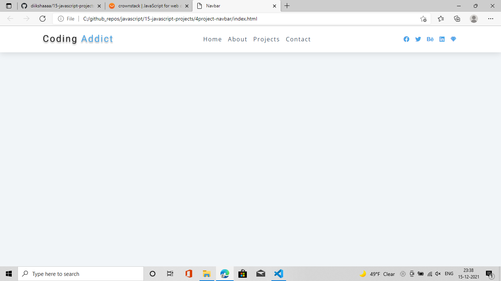

screenshot of fifth project:

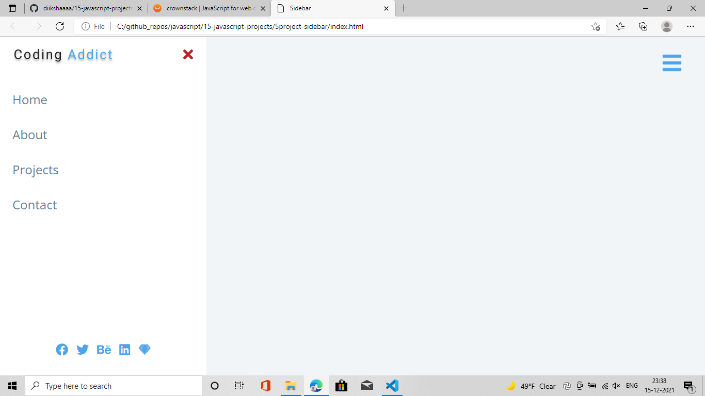

screenshot of sixth project:

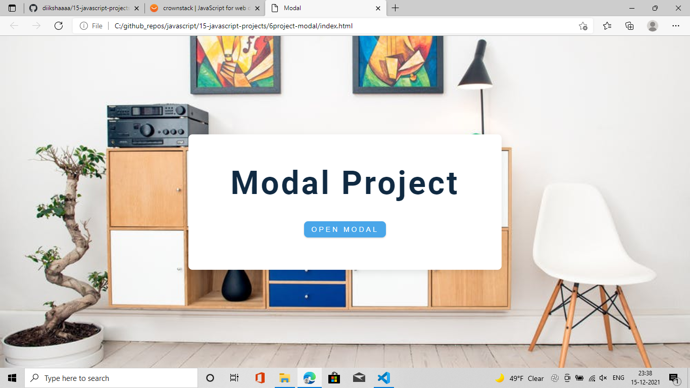

screenshot of seventh project:

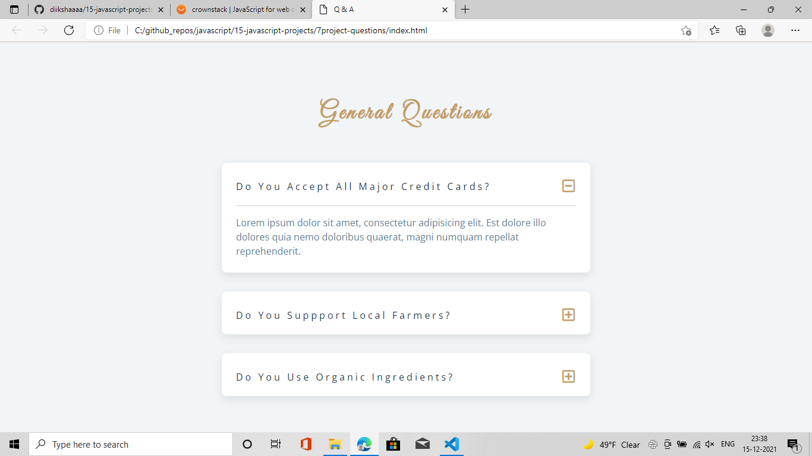

screenshot of eigth project:

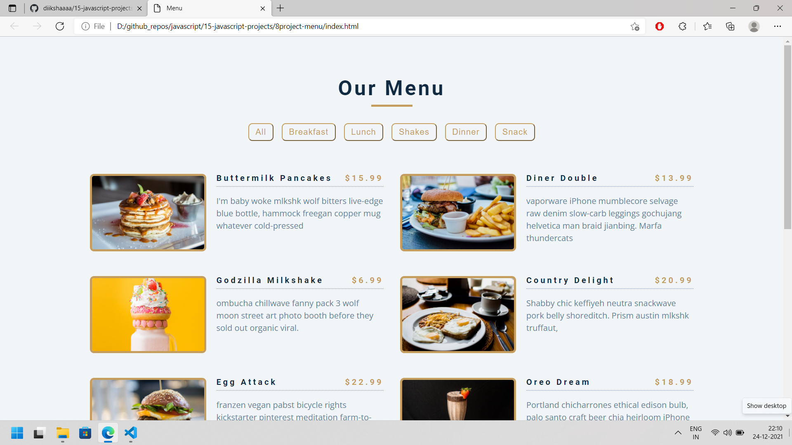

screenshot of ninth project:

screenshot of tenth project:

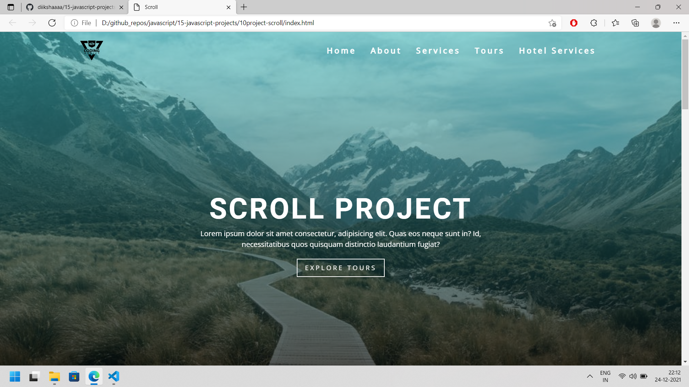

screenshot of eleventh project:

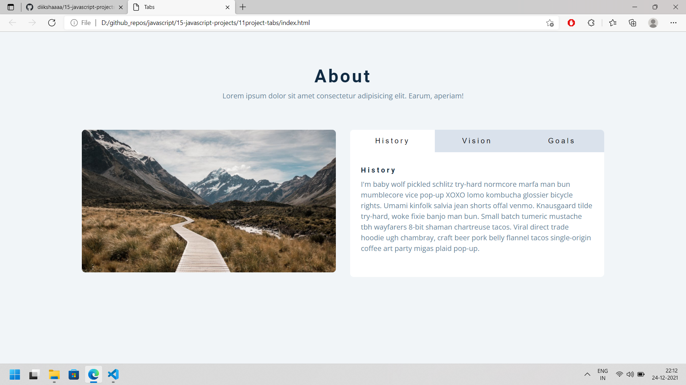

screenshot of twelfth project:

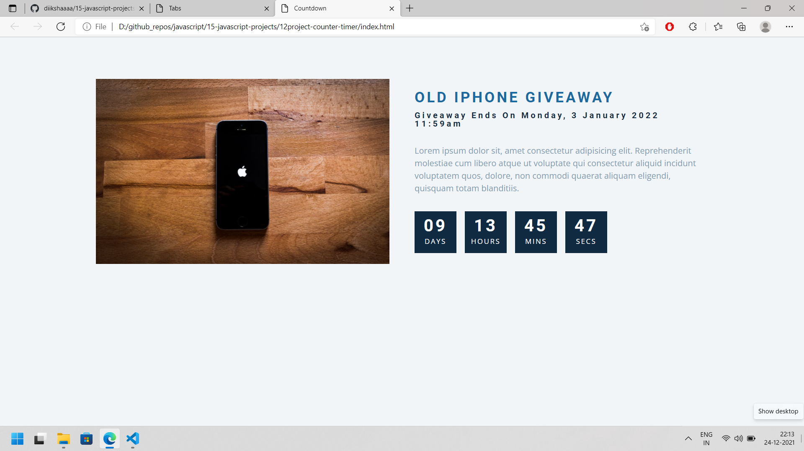

screenshot of thirteenth project:

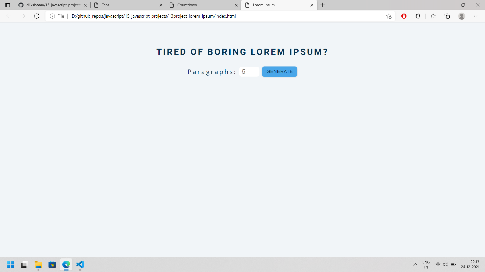

screenshot of fourteenth project:

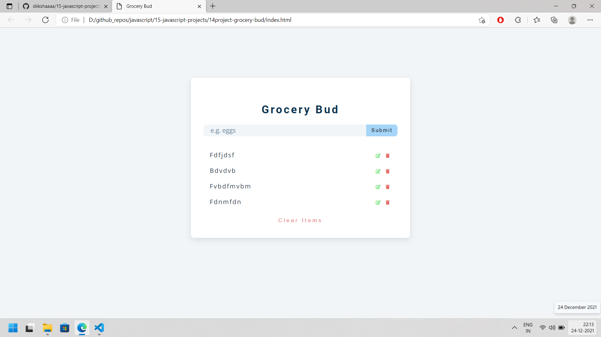

screenshot of fifteenth project:

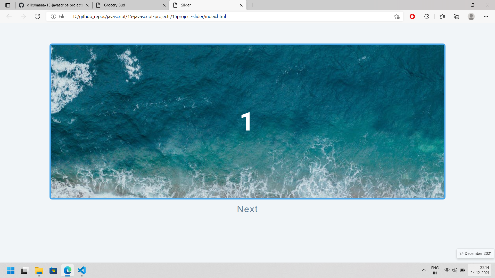
